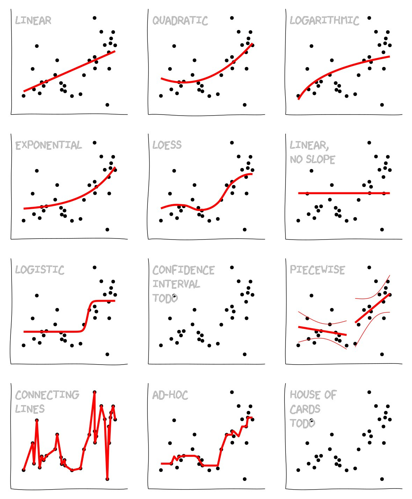

### 1.0 Analysis Fundamentals

**The Challenge:** - Ecologists are generally expected to know a larger range of statistics relative to other fields in biology. In many fields, datasets are large enough that concerns of normality are non-existant or certain disciplines have widely accepted simpler analyses ignoring important assumptions. Ecology is not one of those fields and quite the contrary, ecologists often hold peers to a high standard of statistical quality. Add to this that ecologist must consider an ecosystems' worth of variables, the requirement for knowledge in statistics is high. Luckily for us, more resources are available that provide how-to guides on different analyses and conducting these analyses are becoming increasingly easier. This workshop is here to provide at least a passing knowledge of the core analyses that are expected of ecologist.

**The Mantra:** "My analyses must match my predictions". There are loads of different analyses that can be conduct and over time its becomes easy to think of you computer as a trend-seeking machine. The important thing to remember is that you originally started out with a research question, that developed into a hypothesis with predictions. Your analyses are to answer that research question and must connect directly with your predictions. Becareful if you re-write your project around trends you found that were significant in your analyses. There are many different reasons why this is a bad idea including (but are not limited to): leaves your original question unanswered, could produce errors in design that were not originally considered, or it makes your writing come across as disjunct.

**The Basics:** Data analysis generally has three steps that are data input, data manipulation, and data analysis. Although the analysis component always gets all the attention, including in this workshop, the first two are actually very important. Formatting data for the right analysis is a necessary evil. The data structure of an ordination is completely differnt than a linear model. Converting data between these formats can take hours in excel even with an experienced user depending on the size of the dataset. That is why I begin this workshop with some basics in data inputting and manipulation.

First things first! We will be using different sample data, R functions, and packages throughout this workshop. To simplify things, I have created an R package that has the majority of the tools we need to explore this workshop. To install the package, you will need to install the R package `devtools`. This can be installed with the commands below.

```{r eval=FALSE}
install.packages("devtools")
```

After that, run the following code to install the package that has all the content for this workshop.
```{r, warning=FALSE, message=FALSE}
library(devtools)
install_github("afilazzola/LearnCommAnalysis", dependencies=TRUE, force=TRUE)

library(LearnCommAnalysis)

```


### 1.1 Data format

Data has a certain look for the respective analysis. Univariate analyses typically have a "long" format while multivariate analyses are a "wide" format. I will go into the different between these shortly. First, lets take a look at a dataset should roughly look like. 

We are going to look at one of my published datasets: Alessandro Filazzola, Amanda Liczner, Michael Westphal, and Christopher Lortie. 2017. The response of plant interactions to manipulations of water and consumer pressure during extreme climate events in California. Knowledge Network for Biocomplexity. [doi:10.5063/F1FF3QHH.](https://knb.ecoinformatics.org/view/doi:10.5063/F1FF3QHH)

```{r warning=FALSE, message= FALSE}
library(tidyverse)
library(knitr)

data(samplelong)

kable(samplelong[1:20,1:8])## select only the first 20 rows and 8 columns

```

In this study, we compared the shrub effects on the annual plant community when herbivores are removed (exclosure) and when water is added (watered). Data should be structured with the first columns being identifiers, such as plot ID and site names. These are typically not used in your data analysis and therefore should be at the beginning to not get messed with any manipulations that occur to the right. To the right of your identifiers should be your predictors/treatments. These are the variables that you will regress onto your response varaibles. Your predictors are often your experimental treatments or random effects that are included in models. In the case of this study, the predictors include microsite (shrub treatment), exclosure and watered. To the right of your predictors are your response variables. These are your measured values, such as biomass, abundance of individuals, and species richness. These are general guidelines and more often you will have variables that belong to both predictors and responses. This is a good rule of thumb for set-up that will make life easier moving forward. There are additional considerations that ensure a dataset is complete:
  
  + Make sure zeros and blanks are represented correctly. A zero is a data point! It is the absence of something. A blank is an unmeasured point. Most software treats zeros and blanks differently because they are! Looking for penguins in the arctic will likely result in many zeros. Surveying 10 plots and skipping one makes that missed plot a blank. 
  + Keep common variable names. Most analytical softwares cannot tell different spellings and are case-sensitive. These will be treated as different factors in a model, when they are not. Here, Microsite is either "Shrub" or "Open". Having "shrub" would make a third factor that is incorrect. You can check your data structure after loading it into R using `str`, see below
  + Ensure all your data is together. Different sites, years, and treatments can almost always be grouped together just by adding a column that identifies them. The closer you can be to having all your analyses in the same file, the better. 

--- 

> Box 1.1 The str function

```{r}
str(samplelong[,1:8])
```

The `str` function is surprisingly informative. Here is shows I have 240 observations that corresponds to my 240 plots. It  identifies that my factors: Microsite, Exclosure, and Watered, each have two levels (variables) within. If there was a misspelling, this would be the easiest way to identify it. This function can also provide information about your response variables. Here we can see the number of individuals and species are both discrete counts whereas biomass is a continuous variable. If there was accidentally some text in these columns, the class would likely be something different such as `factor` or `chr`. 

---

### 1.2 Data Input

Imagine a collaborator asked you to send them data you most recently surveyed that has not been analyzed yet. Would they be able to understand whats going on? Would you feel embarassed about the format? The format you used for data input should be balanced between optimizing time when collecting vs. time cleaning afterwards. 

Consider an example where you have to survey 100 quadrats a day at seven different sites. To survey the 100 quadrats will consume the majority of your day because you have to identify each plant to species. Well there are two ways you could conduct this survey:

*Method 1:*

Site name | Species - abd
----------------|-----------------------------------
Quad1   | BRUS - 25, EROD - 10, SCHS - 8, ERFS - 3
Quad2   | BRUS - 22, EROD - 6, JSAA - 1, ERZE - 1
Quad3   | BRUS - 9, JSAA - 1, MAML - 1
Quad4   | EROD - 10, EPCA - 5, ERFS - 2

*Method 2:*

Site name | BRUS | EROD | SCHS | ERFS | JSAA | MAML |  ERZE |
---------|----|-----|----|-----|------|------|------|-------|
Quad1   | 25  | 10  |  8 |  3  |  3   |  0   |   0  |    0  |
Quad2   | 22  | 6   |  0 |  0  |  0   |  1   |   0  |    1  |
Quad3   | 9   | 0   |  0 |  0  |  0   |  1   |   1  |    0  |
Quad4   | 10  | 10  |  0 |  0  |  2   |  0   |   0  |    0  |

The second method is the perferred format for ordinations and is also likely the perferred format for the field if you a select number of species you were to survey. However, if you had lots of species at your site, this means lots of columns, that will likely translate into many pages for data entry. You need to constantly flipped between pages on your clipboard to write down the abundances of species you have found and might find a new species that requires an additional column. The first method, although repeatedly writing the species name out, often requires significantly less time and paper. Inputting your data from the field that was recorded as method 1, but needs to be in an excel file as method 2 can be extremely time consuming and there is a significant chance of error panning endlessly through columns. The solution here is to input your data in Method 1 and then manipulate it. 


Site name | Species | abd
----------|---------|-----
Quad 1    | BRUS    | 25
Quad 1    | EROD    | 10
Quad 1    | SCHS    | 8
Quad 1    | ERFS    | 3

Inputting your data in this format is often the most time effective and allows for the most options in terms of data manipulation into other required formats. Here, Site name represents any identifiers you might use for your dataset and time can be saved by writing down the names once then using auto-complete (In Excel). Species represents all your predictor variables and time could be saved by using a code, such as the species code here. Finally, and represents any of your repsonse variables you would write. Response variables can be tricky to write as either additional columns or to make a column called "response variable" and have all the values in a single column. To keep thing easier for inputting, I usually make a different column for each response variable. 

### 1.3 Data manipulation

Let's take a look at a dataset that has been inputted like this. The common name for this format is long data. 

```{r, echo=FALSE}

data(practice)

kable(practice[1:20,])  ## select only the first 20 rows 

```

This data is ready for univariate analyses to examine the effects of the treatments on each species abundance. What if we wanted to do an ordination on this data? Well first we need to spread it using `dplyr` and `tidyr`packages.

```{r}
## Using the spread function we can convert the data to be ready for multivariate analyses. 
data.wide <- practice %>% spread(Species, Abundance)

## head(data.wide)

kable(data.wide[1:10,]) ## select only the first 20 rows 

```

The `%>%` operator is called pipe and what it is saying to do is take the data that is to the left of it and put it in function to the right. Here we are taking the original data frame and putting it into the spread function. The spread function then asks which column you want to spread by and what values should be used to fill the dataframe. We want the species to be spread across as columns and abundance values to fill the table. 

What about if we wanted to take wide data and make it long? We can accomplish this using the gather function

```{r}

## Using the father function we can convert the data to be ready for univariate analyses. 
data.long <- data.wide %>% gather(Species, Abundance, 6:13)

## head(data.wide)

kable(data.long[1:10,])  ## select only the first 20 rows 


```

The gather function is the inversed version of spread. Again we pipe the dataset into the function, but here we are specifying want the column headings are going to be for two newly created columns. The first column will be the column names of the data we are gathering (the species names in this case) and the second column will be the values. The last argument specifies which tables are to be gathered. 

### 1.4 Data Summarizing

Sometimes for your analyses you do not want to use the raw data, but rather summary statistics. For example, conducting a regression on site-level abundance rather than on the individual plots. One of the simpliest ways of doing this is using `dplyr` package. The workflow for this is three steps: 1) call data, 2) choose predictor variables that are to be summarized by, and 3) choose the response variables that are to be summarized.

Using the same dataset as before, let's calculate the mean, standard error, and n for my exclosure treatments. 

```{r}

data.summary <- data.long %>% group_by(Exclosure) %>% summarize(avg=mean(Abundance), error=se(Abundance), n=length(Abundance))

data.summary

```

The `group_by` is our grouping variable and `summarize` selects the response variables that can be summarize by any R function (e.g. `mean`, `sd`, & `length`) or by ones you have written. 

The benefit of this format is that you can group by more variables to get summary statistics for all the subgroups. 

```{r}

data.summary <- data.long %>% group_by(Exclosure, Species) %>% summarize(avg=mean(Abundance), error=se(Abundance), n=length(Abundance))

data.summary

```


