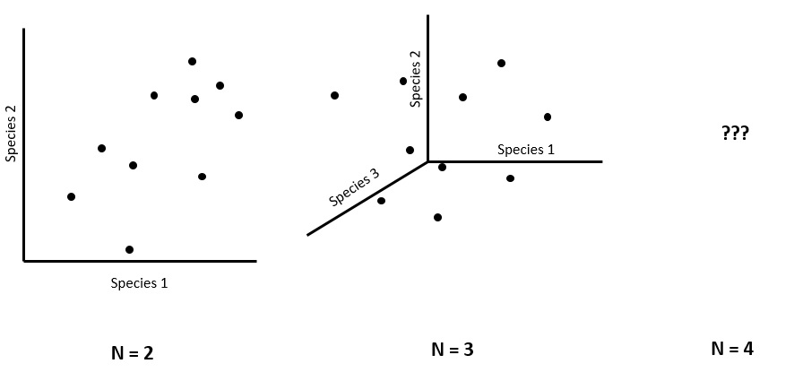

### 3.0 What is multivariate data

Multivariate data is what occurs when you have multiple response or predictor variables. Multivariate data is typically in the "wide" data format and can resemble items such as a list of species, soil chemistry variables, or plant traits. As ecologists trying to understand these variables, we need to minimize the dimensionality of these variables. The reason being is that we struggle to understand trends beyond 3-dimensions. 

Imagine plotting the abundance of one species against another. Then imagine adding a third species to that graph in the form of another axis. This might still make sense, now imagine adding a four axis, what does that look like? Imagine adding 35 axes. Because it is impossible to comprehend a multi-dimensional structure that comprises our multivariate data, we use data reduction techniques to put this information into two dimensions. 




### 3.1 Relevance of ecological indices

Ecological indices are an approach to simplify mutivariate data into univariate data to allow for easier analysis or description. Indices as a result have become incredibly popular for ecologists as a way to reduce the multi-dimensionality of ecosystems into something that is more manageable. One commonly described index is Shannon-Weaver's Diversity Index that produces a single value based on the relative abundances of many species. These indices have arguable benefits and limitations. With multivariate analyses becoming easier to conduct, there has been a departure from the majority of these indices. However, ecological indices are not going away just yet. Particularly, because science has a component of communication and making it easier to describe trends has obvious benefits. In other cases, indices can convey more information than the species identity on its own. 

Let's begin with a familiar one, Shannon-weaver's. This requires us to load the `vegan` library that is responsible for the majority of multivariate analyses in ecology. 

```{r warning=FALSE, message=FALSE}
library(LearnCommAnalysis)
library(vegan)


## check to see where the species list are
head(multivar)


## separate species and predictor columns
spp.data <- multivar[,7:46] ## select only species
pred.data <- multivar[,1:6] ## select only predictors and identifiers

## calculate shannon index
div.data <- diversity(spp.data, index = "shannon")

## combine with predictors
div.data <- cbind(pred.data, div.data)

## see what it looks like
head(div.data)

## example of plot
mean.div <- div.data %>% group_by(Microsite, Elevation) %>% summarize(Average.Diversity=mean(div.data))

ggplot(mean.div) + geom_bar(aes(x=Elevation, y=Average.Diversity, fill=Microsite), color="black", stat="identity", position = "dodge") + scale_fill_brewer()
```

Here, we have reduced the entire community composition into a single diversity index and used the mean to compare among sites. We can see that there appears to be a general trend with elevation. The sites at higher elevations tend to have larger differences between treatments.

### 3.2 Diversity indices

The above diversity indices are usually to estimate local diversity. What if we were interested in the diversity between sites (beta) or the overall regional diversity (gamma). We are able to calculate these through a variety of different metrics that have been explored previously. First, let's explore beta diversity on a sample dataset using `betadiver`. If we do not specify the index we can the *a*, *b*, and *c* values for all sites. If an index is specified, then distance-based matrixes are generated using the relevant equation. 


```{r}
data(dune)

beta.n <- betadiver(dune)
plot(beta.n)

beta.whit <- betadiver(dune, "w")
beta.whit
```

Whittaker's index has limitations in that it increases sampling effort. Alternatives for estimating beta-diversity include dissimiliarity indices, such as Jaccard or Sorensen for presence/absence or Bray-Curtis for abundance data. These can be calculated using `vegdist`. More information and potential limitations of these indices can be found [here](https://besjournals.onlinelibrary.wiley.com/doi/full/10.1111/2041-210X.12029)

Using the raw distance based matrix though can be uninformative. Instead, we may choose to find out the average beta-diversity values among treatments. Exploring the dune dataset again but now adding different manure treatments and then follow that up with a cluster analysis to determine the treatments that were similar in composition

```{r}
data(dune.env)

## join column to summarize by
dune2 <- cbind(dune.env["Manure"],dune)

dune.man <- dune2 %>% group_by(Manure) %>% summarise_all(sum) %>% data.frame(.)

BC.div <- vegdist(dune.man[,-1], method="bray") ## drop first column with treatment

clus <- hclust(BC.div, "ward.D2") ## run cluster analysis
plot(clus, label=dune.man$Manure) ## add labels for manure levels
```

### 3.3 Species accumulation curves

Rarefaction curves and species accumulation curves are two different methods for determining changes in species richness with area or survey effort. However, these two items are not the same thing! This is probably the best definition of the difference: 

> Rarefaction curves are useful for comparing species richness values for different sampling efforts. Rarefaction cannot be used for extrapolation as it does not provide an estimate of asymptotic richness. In addition, under-sampling which is common ..., often result in an over estimate of the number of ‘rare’ species (e.g. singletons and doubletons); and the greater number of ‘rare’ species reported in a dataset the more likely it is that other species that are present have not been detected.

Using species accumulation curves it is possible to determine the heterogeneity of diversity between treatments or sites. You can also compare rarefaction curves to species accumulation curves. The difference between the two curves indicates aggregation or overdispersion of conspecific individuals. Put differently, the more the species accumulation curve deviates from the rarefaction curve, the less often individuals of the same species are found clustered together. 

To examine this further, we can plot both rarefaction and species accumulation curves in `vegan`

```{r}
data(dune)

accum1 <- specaccum(dune, method="rarefaction")
accum2 <-specaccum(dune, method="random")

plot(accum1, col="blue", ylim=c(0,30), ci.type="polygon", ci.col="#00FFFF40")
plot(accum2, add=T, col="orange", ci.type="polygon", ci.col="#FFA50040")

```

Based on these curves we can see our data approach an asymptote. There is the chance though that some species were missed from our sampling. We can estimate approximately the expected number of species that were missed. These are based on exrapolated richness values calculated by a few individuals, includes Bob O'Hara who invented the `estimateR` software. See also the references by [Colwell & Coddington 1994](https://www.ncbi.nlm.nih.gov/pubmed/7972351) and [Chiu et al. 2014](https://www.ncbi.nlm.nih.gov/pubmed/24945937)

We use the function `specpool` to determine the number of unsampled species. There are multiple calculations that are provided based on different authors. We try it here to see the output

```{r}
specpool(dune)

```

Here we can see that We are missing btween 1-5 species based on the different approaches and standard error. This relatively small missing number of species is expected given we saw asymptotes in our datasets. We can try this again using different treatments.  Here n represents the different number of sites. 

```{r}
data(dune.env)

specpool(dune, dune.env$Management)

```


### 3.4 Effect-size estimates

What if we were less interested in the raw values of our diversity index and instead were more interested in the relative difference between our treatments. Imagine our earlier example of shrub effects at different elevations. What if we want to know only if the shrub has relatively higher diversity than the open microsites, rather than what that value was. 

These are generally called effect-size estimates and are popular in community ecology. One of the more commonly refered effect-size estimates are Hedge's g or Cohen's d. Both of these are often used in effect size estimates and are ratios of means and standard deviations between two populations. In this case, the two populations would be our two treatments. However, community ecology tends to use a few others. Two that are used commonly are log-response Ratio and relative interaction index. We will introduce the latter.

The relative interaction index (RII) was created by Cristina Armas in [opposition to LRR](https://esajournals.onlinelibrary.wiley.com/doi/full/10.1890/03-0650). It's benefits are in its simplicity. It is symetrical, between -1 and 1, where -1 is a control effect and +1 is a treatment effect. RII is also bound between -1 and 1 making it comparable to other studies or responses. The formula for it is below:
$$\frac{treatment - control}{treatment + control}$$

Where this shines for community ecology, is that treatment can represent the presence of competing of facilitating  species, and the control is the absence of that species. Let's go back to our previous example. We want to know if the shrub is having a facilitative (+1) or competitive (-1) effect on the entire plant community. We calculate RII using the RII function

```{r warning=FALSE, message=FALSE}

?se
?rii.fun

## convert identifier values as factors
div.data[,1:5] <- apply(div.data[,1:5], 2, as.factor)

## Use RII function to calculate RII
rii.data <- rii.fun(div.data, "Microsite", Shrub, Open)


## see what it looks like
head(rii.data)

## example of plot
mean.rii <- rii.data %>% group_by(Elevation) %>% summarize(RII.diversity=mean(div.data),error=se(div.data))

## plot RII with confidence band
ggplot(mean.rii, aes(x=Elevation, y=RII.diversity)) + geom_point() +  geom_errorbar(aes(ymin=RII.diversity-error, ymax=RII.diversity+error), width=.2)
  

## Add line of significant  
ggplot(mean.rii, aes(x=Elevation, y=RII.diversity)) + geom_point() +  geom_errorbar(aes(ymin=RII.diversity-error, ymax=RII.diversity+error), width=.2)+ geom_hline(yintercept=0, linetype="dashed", color = "red", lwd=1)

```

Once we plot the calculated RII effect sizes and their associated error we can see that there does not appear to be a significant facilitation effect at low elevations. However, at the highest elevations, the shrub is having a positive effect.

This can appear as an over simplification of your dataset, but effect size measures such as RII are useful for relative comparisons over larger gradients. For example, imagine you measured the relative different of every plant species along an elevation gradient. Trying to detect an observable trend in the relative differences of say 20 species using a bar graph is challenging. Additionally, effect size measures can be used to compare between predictors or responses variables to determine which is more strongly effected by the treatment.

For those looking for a more robust calculation of effect sizes, you can explore bootstrapped effect sizes using the package [bootES](https://www.ncbi.nlm.nih.gov/pubmed/23519455)

