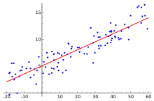

### 2.0 What are univariate analyses?


```{r setup, include=FALSE}
knitr::opts_chunk$set(echo = TRUE)
```



A univariate analysis is a statistical test that compares a response variable to a series of predictors. There are many different versions inclduing linear regression, ANOVAs, ANCOVAs, and GLMs. We are going to briefly touch upon the math and then go into the differences between these models. 

First, let's touch upon the math behind linear regressions. The form for a linear regression is as follows:

`E [Y] = β X + ε`

This equation states that the expected value of a dependent variable (E[Y]) is determined by the value of a predictor variable (X) multiplied by a parameter coefficient (β) plus a residual (ε). In other words, your response is determined by your predictor multiplied by some value plus or minus some difference. 

Ex. Let's say that you are a jogger that runs every day and you want to determine the speed that you run at. You record the duration and distance that you run every day. Thus, the predictor is the duration of your run per day, the response is the distance that was run, and the parameter coefficient is the speed that you run at. The residuals in this model are represented by unexplained variation from this relationship, such as you having to stop to tie your shoe that would increase the length but not the distance. 

```{r warning=FALSE, message=FALSE}
library(LearnCommAnalysis)


duration <- c(30,60,45,44,36,58,57,22,25)
distance <- c(2.5,5.1,3.9,3.9,3,4.9,4.8,1.7,2.1)

plot(duration,distance)
```

To determine this parameter coefficient we run a linear model using the `~` tilda as the regressor. The formula is represented as such:

```{r}
m1 <- lm(distance~duration) ## linear model with response ~ predictor
summary(m1) ## see output of model
```

Here the parameter coefficient is under Estimate as 0.087 kilometres per minute or 5.22 kph. We also notice that the p value is extremely small and the R squared close to 1. These inform us that the model fits accurately. We can plot this relationship using the `abline` function. The distance between the line and each point is the residuals `ε`

```{r}
plot(duration,distance)
abline(m1, col="red") ## adds line from model
```

A Generalized Linear Model (GLM) is extremely similar to that of the LM in this regard. However, where the GLM differs is that it has an extra parameter called a "link function" (g^-1^). The link function determines how the mean of the response is related to the predictor. Thus, the GLM is represented as:

`E [Y] = (β X + ε) * g^-1`

Why use a GLM? There are three reasons why GLMs may be more appropriate:

* The response variable Yi is not normally distributed or the range is restricted (e.g. binomial, Poisson)
+ The variance of Y depends on the mean. 
+ GLMs can fit to particular distributions without transformations. The benefits of this include i) the homogeneity of variance does NOT need to be satisfied and ii) the response variable does not need to be changed. 

This last assumption has some associated complexities that could be read more on [here](http://stats.stackexchange.com/questions/67547/when-to-use-gamma-glms). However, as a rule, log transforming a response variable and then fitting it to a normal distribution is not the same as conducting a GLM with a log link. 

`E(log(Y)) ≠ log(E(Y))`

### 2.1 Working example of a GLM

To best understand how a GLM is executed, it is a good idea to go through an example. As said above, at the most basic, a GLM compares a response to one or more predictors. Let us consider a population of people that have a disease. Three drugs are being considered as potentially curing this disease. Eighty people are randomly divided into four groups, three for each drug treatment and one as a control. We would like to see if a drug was effective. 

This is an example of a logistic regression that is a member of the GLM family fit to a binomial distribution. The response variable here is not normal because the outcome of an individual can only be two values: 1 = cured or 0 = not cured. 

```{r}
##load data
head(drug.trial)
```

The formula has the same syntax as the LM shown above. The response is followed by the tilda and the predictors. Here, we also specify where the data is coming from. In this case it is coming from the drug.trial data frame we created. Lastly, the main nuance of using the GLM function is the specification of a family. Since our data is binary and follows a binomial distribution, that is what we refer to it as. 
```{r}
m2<- glm(response~predictor, data=drug.trial, family="binomial") ##glm for drugs potential to curse

summary(m2) ##output of model
```

The output of the model reveals lots of information. The most important things to look at are the coefficients and the residual deviance. The GLM takes one of the predictor factors and treats it as a "dummy" variable. The result is that all the other factors are compared against that first value. These P-values therefore represent a comparison of each drug to the control which in itself is interesting, but not exactly what we are looking for. It is also important to examine the residual deviance and the residual degrees of freedom. As a general rule of thumb, the deviance should not be more than double the degrees of freedom, otherwise your data is overdispersed. You can read more here about [dummy variables](http://stats.stackexchange.com/questions/94010/understanding-dummy-manual-or-automated-variable-creation-in-glm) and [overdisperson](https://sada2013.sciencesconf.org/16139/document).

The summary results does not quite answer our question. We are interested if the drugs have an effect and if so, which drug is the best? To do this we need to conduct a significance test on the predictor to see if the effect is significantly different than zero. For binomial distributions this can be done with a chisq test. 

```{r}

anova(m2, test="Chisq") ## chisq test on predictor from model
```

Here we see that degrees freedom from the model (i.e. n-1), the residual deviance and DF again from the model output. The p-value here identifies that the effect is significant. R for some reason refers to the Chi-sq value from this test as "deviance". Judging by the high Chi-sq value, we can believe that the effect of this predictor is significant. We now must determine which drug treatment is most effective. 

### 2.2 Pairwise comparisons and packages

To see which drug is most effective, we need to conduct pairwise comparisons. There are many packages that are available in R to do this. One of the easier ones to work with is `lsmeans`. 

```{r}
library(lsmeans)
```

The syntax for conducting a pairwise comparison is model, type of comparison (in this case pairwise), and lastly adjustment type. Tukey is a common technique that is also used for ANOVAs. 

```{r}
lsmeans(m2, pairwise~predictor, adjust="tukey") ##conduct pairwise comparisons on predictor
```

The output of this function provides a lot of information including the model statistics for each of the groups. However, the most relative content now to our question is the p.value to determine which groups were different from one another and the estimate to see in what direction. Here, we can see that the only group that is significantly different is drug3. This drug was more effective than a control and drug1, although it had a similar cure rate as drug2. This is a typical workflow for a GLM that begins by testing the effect of the predictor and is followed by a pairwise comparison to determine where the significance can be attributed to. 

### 2.3 Different types of GLMs

There are many different types of GLMs that are possible in addition to the `binomial` family. Some of them involve changing the family in the glm function to the most appropriate data distribution. Other commons families include:

family          | type of data 
----------------|------------------------------
binomial        | binary (y = 0,1) or proportion (0<y<1).
poisson         | discrete count (y = 0, 1, 2, 3 ... i).
gamma           | continuous data that is right skewed, positive, and is on the log scale.
quasibinomial   | binary or proportion data that is overdispersed
quasipoisson    | discrete count data that is overdispersed. 

Quasibinomial and quasipoisson compensate for overdispersed data with an extra parameter `ϕ`. Theta here is a dispersion parameter that attempts to describe additional variance that cannot be explained by the distribution alone. As a general rule of thumb follow this workflow.


### 2.4 Try it yourself

Here is an example of bird surveys in Southern Ontario in forests, urban parks, and city centers. Determine if there is a difference between the habitats and which was the greatest. 

```{r}
head(bird.data)
```


### 2.5 Generalized Linear Mixed Model

A Generalized Linear Mixed Model (GLMM) is a type of GLM that includes a random effect. Random effects are variables that are included in the model to account for common variance among your replicates. Let's consider a regular linear regression, where you have different levels of animal grazing. Here, the number of cattle per hectare is a fixed effect and is represented by the x-axis (predictor variable). The response variable is amount of surveyed biomass. 

```{r}
## Make up some data
head(ranch)

plot(ranch$cattle, ranch$biomass, ylab="Biomass (kg/m)", xlab="Cattle (per ha)", pch=19)

```

We can see the relationship is linear, but these samples are not independent from each other, which violates an assumption of linear regression. These samples were collected over four different years 2014 - 2017. If you were interested in examining year effects on grazing you could include year as a fixed effect and have an interaction term `grazing * year` to satisfy that assumption. However, what if the assumption is that the differences among years effect everything equally. That is to say, different years can have different biomass values at the sites because of grow conditions, but cattle at their respective densities, will always eat a consistent amount. In this case, you fit year as a random effect because you are not interested in year effects, but are still accounting the associated variation. Another way to consider it, is a random effect is something that should effect the y-intercept of your linear model and a fixed effect is something that would effect the slope. Although there are random effects that consider slope as well (see [here](http://www.bristol.ac.uk/cmm/learning/videos/random-slopes.html)), this will cover most instances.

**NB** One thing important to note is that random vs. fixed effects are determined by your research question. If your question was "What are the effects of inter-annual variability on grazing?" you must treat year as a fixed effect. 

To conduct a mixed model requires the package `lme4` and the random factor is fitted using the operator `(1 | randomeff)`

```{r, warning=FALSE, message=FALSE}
library(lme4)

m1 <- lmer(biomass ~ cattle + (1|year), data=ranch)
summary(m1)
```

But wait?! There are no p.values? There is a fairly long, but [humourous explanation](https://stat.ethz.ch/pipermail/r-help/2006-May/094765.html) by Douglas Bates who wrote the `lme4` package as to why there are no reported p.values. The short version is that the degrees freedom can only be approximated and thus p.values cannot be calculated. There are a few solutions, the easiest being comparing the mixed model to one with just an intercept. This effectively determines if the fixed effect is signficant but gets unweidely the more predictor variables that are in your model.

```{r}

m1 <- lmer(biomass ~ cattle + (1|year), data=ranch)
m0 <- lmer(biomass ~ 1 + (1|year), data=ranch)

anova(m1,m0, test="Chisq")

```

The solution recommended by Bates is to use a Markov Chain Monte Carlo sample, but I find this computer intensive and some people struggle understanding the output. Instead, I take the same approach as SAS (i.e. Satterthwaite's Method) to calculate p.values in mixed models that can be replicated using the `lmerTest` package

```{r warning=FALSE, message=FALSE}
library(lmerTest)

m1 <- lmer(biomass ~ cattle + (1|year), data=ranch)
anova(m1)
```

### 2.6 Generalized Additive Models

GAMs borrow all the flexibility of GLMs with the exception of being able to account for non-linearity. A person with the above knowledge could easily fit a basic GAM once they have learned the syntax in R. However, there is some degree of complexity in determining the smoothing term that is associated with the fit. Dr. Gavin Simpson has many [resources](https://www.fromthebottomoftheheap.net/2014/05/09/modelling-seasonal-data-with-gam/) and tutorials that do a great job explaining everything that is GAM. In a sense, a GAM will do almost anything you ever want because it is a GLM with no boundaries. There are two general caveats though before you consider the GAM route:

1) Fitting polynomials beyond quadratic rarely make sense ecologically (but remember that rarely is not the same as never and climate data often requires more complex polynomials)
2) Currently, there is preference for GLMs over GAMs particularly when one includes interaction terms. 


The main package for GAMs are `mgcv`. We can explore fitting a simple GAM model with the previous ranch data. What changes in a GAM is the presence of a smoothing term. 


```{r warning=FALSE, message=FALSE}
library(mgcv)

head(gam.data)

## Plot the data
ggplot(gam.data, aes(x=year, y=ndvi)) + geom_point()

## Run a linear model
m1 <- lm(ndvi~year, data=gam.data)
summary(m1)

## add linear model to plot
ggplot(gam.data, aes(x=year, y=ndvi)) + geom_point()+  geom_smooth(method = "lm", formula = y ~x)

## check the fit
par(mfrow = c(2,2))
plot(m1)

```

When we plot changes in NDVI over three decades, we notice that there appears to be a non-linear trend, potentially following some form of cycle or determine by a driver that shifted twice significantly. If we were to fit a typical linear model, the response is significant. However, when we look at the diagnostic plots, there are some strongly suspicious findings. Particularly, with the residuals vs the fitted values. 

Instead, we fit a GAM with year fitted to a smoothing term. You can specify the type of polynomial you want fit, but since this is more of a data exploration, I will leave that argument blank. 

```{r}

## Fit GAM
m2 <- gam(ndvi~s(year), data=gam.data, method="REML")
summary(m2)

## check diagnostics
par(mfrow = c(2,2))
gam.check(m2)

## see final plot
ggplot(gam.data, aes(x=year, y=ndvi)) + geom_point() +  geom_smooth(method = "gam", formula = y ~s(x))

```

Here we can see from the diagnostic plots that the residuals more closely resemble the fitted values and that we have a relatively normal distribution in the residuals. Using `ggplot` has a feature that allows for the plotting on GAMs in addition to the others we described, such as glm and linear models. 

GAMs can also fitted random effects, and they fit a form of interaction that is similar to running two nested GAMs separated by the respective factors. Careful attention must be paid to the fitting of the smoothing terms and splines. It is not okay to trust the defaults. 


```{r}
## Change back plot pattern
par(mfrow = c(1,1))
```