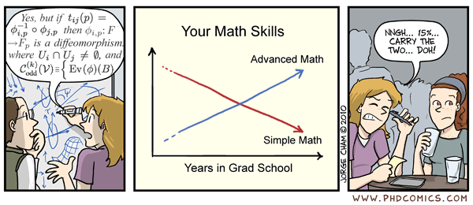

```{r, warning=FALSE, message=FALSE}
library(tidyverse)
```

### 4.0 Graphics 

Visulization is the final step in data analysis and is definitely an important one. Communicating your data in a way that is easy to understand and shows the trends without misrepresentation can be quite challenging. There are books, courses, and workshops all dedicated to proper data presentation. [**The grammar of graphics**](https://www.amazon.com/Grammar-Graphics-Statistics-Computing/dp/0387245448) is a note worthy example if you are interested in getting deeper into graphic presentation. The short time within this workshop will not be enough to get deeply into it, but I will briefly touch upon how to present some of the trends we observed today. 

First, its important to describe that there are two main competing methods for producing plots in R. These are usage of base R graphics vs. ggplot2. There are other methods as well, especially for specific analyses such as network analyses or phylogenetics (see `factoextra` package from ordination section), but these are the leading two methods for more classical figures (e.g. bar plot, scatter plot, boxplot, etc). Both have pros and cons, and each has their day in the light. Me personally, I use ggplot2 for scatter, bar, and box plots, but then use base R for ordinations, cluster analyses, and histograms. I would recommend choosing the method you find easiest because you can generate plots that look identifical using both pathways. Its just a matter of which makes more sense intuitively. Slightly more people say that ggplot2 has a lower learning curve so that is the one I will cover today.

### 4.1 Histograms or density plots

There are resources for understanding the dialect of ggplot, such as [this one](data-visualization-2.1.pdf). One of the key things to understand is that ggplot functions with layers and that call has an almost independent effect on the graph relative to the other elements. Thus, if you are looking for some quick analyses, calling the data and variables in the `ggplot` function is the fastest and most efficient way to produce plots. However, if you are looking for more customization, then the `ggplot` should remain empty and the data called in each argument. Here is an example of what I mean. For this we are going to use the `mtcars` dataset in base R. 

```{r}
head(mtcars)

## using data in ggplot call
ggplot(mtcars, aes(x=hp)) + geom_histogram()

## leaving ggplot empty 
ggplot() + geom_histogram(data=mtcars, aes(x=hp)) 

```

The advantage of the second method is that you can add layers
```{r}
ggplot() + geom_histogram(data=mtcars, aes(x=hp)) + geom_histogram(data=mtcars, aes(x=hp+20), fill="red") 

```

In these instances, it may be preferable to use a density plot to have a more smooth response. We can also make the colours transparent to show overlap using the `alpha` arguement. 
```{r}
ggplot() + geom_density(data=mtcars, aes(x=hp), fill="black", alpha=0.5) + geom_density(data=mtcars, aes(x=hp+20), fill="red", alpha=0.5) 

```

Finally, we clean up the text using the `lab` and `theme` arguments. 
```{r}
ggplot() + geom_density(data=mtcars, aes(x=hp), fill="black", alpha=0.5) + geom_density(data=mtcars, aes(x=hp+20), fill="red", alpha=0.5) +
  xlab("horsepower") + ylab("frequency of cars") +
  theme_bw() + theme(text = element_text(size=14))
```


### 4.2 Bar plots

Bar plots are among the most challenging of the easy plots to generate. They require first to summarize the data before plotting. Let us compare the differences in horsepower between cars based on the number of cylinders. To do this, we need to calculate the mean and error. We borrow our knowledge of using `group_by` and `summarize`

```{r}
## write function for error
se <- function(x) { sd(x)/sqrt(length(x))}

## calculate mean and se
carsSummed <- mtcars %>% group_by(cyl) %>% summarize(pwrAvg = mean(hp), pwrSE=se(hp))

carsSummed

```

Once the stats have been generated you can plot in ggplot
```{r}
ggplot(carsSummed) + geom_bar(aes(x= cyl, y = pwrAvg), stat="identity") 
```

Add error bars
```{r}
ggplot(carsSummed) + geom_bar(aes(x= cyl, y = pwrAvg), stat="identity") +
  geom_errorbar(aes(x=cyl, ymin=pwrAvg-pwrSE, ymax=pwrAvg+pwrSE))

ggplot(carsSummed) + geom_bar(aes(x= cyl, y = pwrAvg), stat="identity") +
  geom_errorbar(aes(x=cyl, ymin=pwrAvg-pwrSE, ymax=pwrAvg+pwrSE), width=0.4)

```

### 4.3 Scatter plots

Finally, we will look at scatter plots in R. Scatter plots are for comparing an independent variable against a dependent variable, most often using one of the linear models we discussed. Plotting scatter plots with ggplot are among the easiest. Here, we will compare `mpg` to `hp`

```{r}

ggplot(mtcars) + geom_point(aes(x=hp, y=mpg))
```

We can clean up our plot using some labels.
```{r}
ggplot(mtcars) + geom_point(aes(x=hp, y=mpg)) +
  xlab("horsepower") + ylab("fuel efficency (miles per gallon") +
 theme(text = element_text(size=14))
```

One of the best features of ggplot is its ability to plot all the linear models we talked about earlier in this workshop. Unfortunately, more complex models such as GLMM have limit support, typically the majority of analyses can be presented this way. To do so, you can use the geom_smooth function. 

```{r}
ggplot(mtcars) + geom_point(aes(x=hp, y=mpg)) +
  xlab("horsepower") + ylab("fuel efficency (miles per gallon") +
 theme(text = element_text(size=14)) +
  geom_smooth(method="lm", aes(x=hp, y=mpg)) ## fit model
```

We can then run the most to determine what the coefficients and outputs are. 
```{r}
m1 <- lm(mpg ~ hp, data=mtcars)
summary(m1)
coef(m1)
```

Although, this may be better represented as a GAM
```{r}
ggplot(mtcars) + geom_point(aes(x=hp, y=mpg)) +
  xlab("horsepower") + ylab("fuel efficency (miles per gallon") +
 theme(text = element_text(size=14)) +
  geom_smooth(method="gam", aes(x=hp, y=mpg), formula= y ~ s(x)) ## fit model

```

### 4.4 Hack-a-thon

I encourage you all to experiment with the `mtcars` dataset and to familiarize yourself with the concepts from today. 